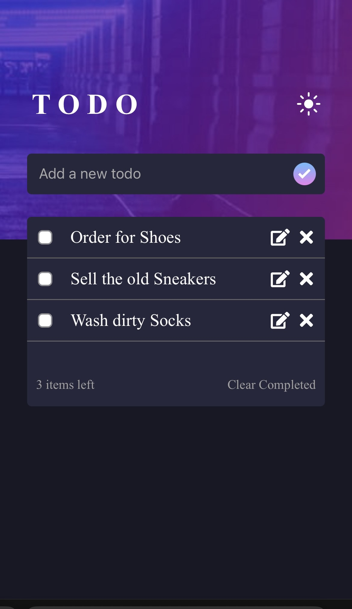
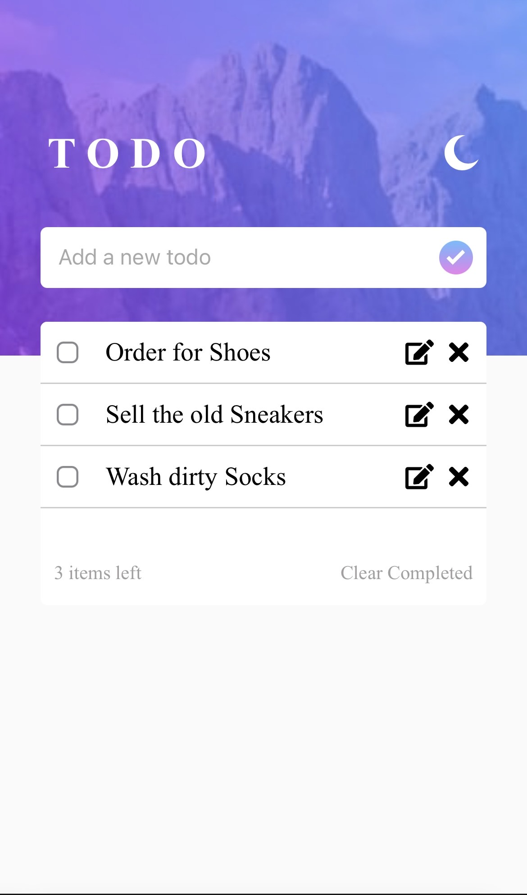

# Todo Application

A scalable and interactive Todo application built with React.js, Redux, and Redux Persist. The application allows users to add, edit, toggle, and delete tasks while persisting the data in the browser's local storage.

---

## **Features**

- **Add Todos:** Create new Todo items with a title.
- **View Todos:** Display a list of all added Todos.
- **Edit Todos:** Modify the title of existing Todos.
- **Delete Todos:** Remove unwanted Todo items from the list.
- **Toggle Status:** Mark tasks as complete or incomplete using a checkbox.
- **Dark/Light Mode:** Switch between dark and light UI themes for better accessibility.
- **State Persistence:** Todos are saved in the browser's local storage using Redux Persist, ensuring data remains intact even after refreshing the page.
- **Responsive Design:** Fully mobile-friendly and responsive UI designed with TailwindCSS.

---

## **Live Demo**

Demo link will be here once deployed

---

## **Preview**

| Dark Mode                                | Light Mode                                 |
| ---------------------------------------- | ------------------------------------------ |
|  |  |

---

## **Setup and Running Instructions**

### **1. Prerequisites**

Ensure the following software is installed on your system:

- **Node.js:** Version 14.x or above
- **npm or yarn:** Latest version
- **Git:** For cloning the repository

### **2. Clone the Repository**

```bash
git clone https://github.com/1skepta/Todo-Application.git
cd Todo-Application
```

### **3. Install Dependencies**

Run the following command to install all the project dependencies

```bash
npm install
```

or

```bash
yarn
```

### **4. Start the Development Server**

To run the app locally, use:

```bash
npm start
```

or

```bash
yarn start
```

The app will be available at http://localhost:3000 in your browser.

### **5. Start the Development Server**

To build the app for production, use:

```bash
npm run build
```

or

```bash
yarn build
```

The optimized app will be availabl in the build/ directory.

---

## **Application Workflow**
